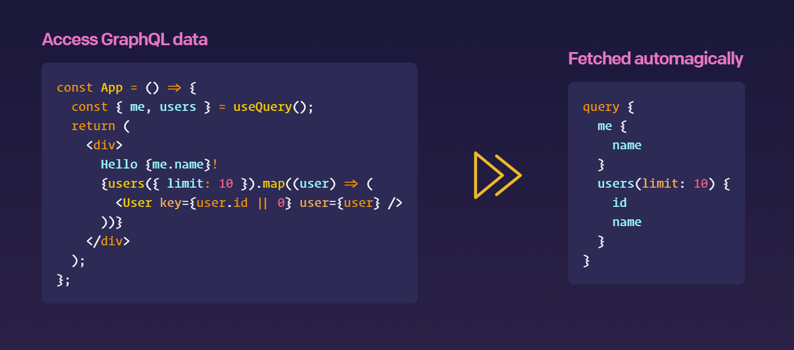

  

<h2 align="center">
  The No-GraphQL Client for TypeScript

</h2>

---

Head over to [gqty.dev](https://gqty.dev) to explore features and documentation.

---

## Get involved

Documentation, bug reports, pull requests, and all other contributions are
welcome! See [`CONTRIBUTING.md`](CONTRIBUTING.md).

Docs powered by [Vercel](https://vercel.com/?utm_source=gqty&utm_campaign=oss)
